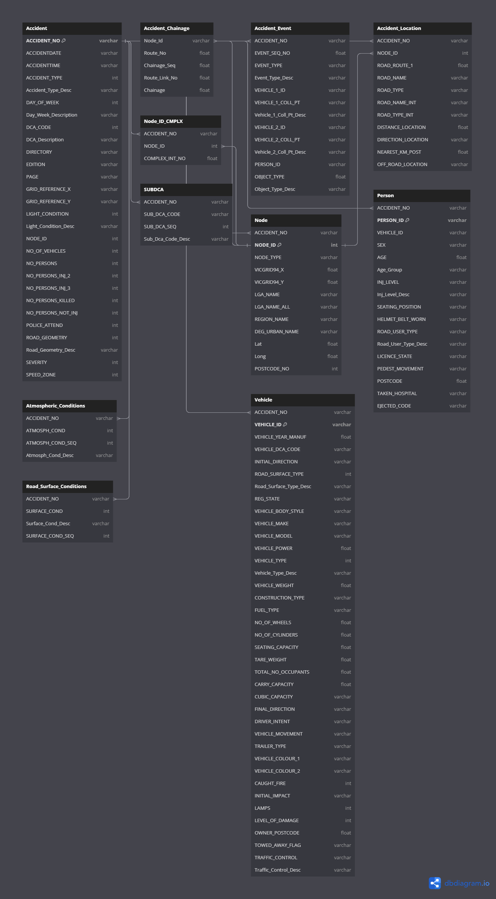

# CrashStats Case Study

## Table of Contents

1. [Introduction](#introduction)
2. [Audience](#audience)
3. [EDA Questions Answered](#eda-questions-answered)
4. [Problem Statement](#problem-statement)
5. [Approach](#approach)
6. [What we hope to achieve](#what-we-hope-to-achieve)
7. [Project Structure](#project-structure)
    - [models](#models)
    - [notebooks](#notebooks)
    - [src](#src)
8. [Setup](#setup)
9. [Usage](#usage)

## Introduction

This project aims to address road safety issues by using machine learning to analyze various factors that contribute to the severity of accidents and predict the severity of an accident on the basis of chosen variables.

We utilize data from the [VicRoads CrashStats Dataset](https://data.vicroads.vic.gov.au/Metadata/Crash%20Stats%20-%20Data%20Extract%20-%20Open%20Data.html) to conduct our analysis and train our model. 

The Entity Relationship between the tables of the dataset is as follows:

## Audience

The primary audience for this project includes Victorian Local Councils and Victorian Police.

## EDA Questions Answered

The exploratory data analysis (EDA) aims to identify factors that contribute to the severity of accidents.

## Problem Statement

The project aims to reduce the frequency and severity of traffic collisions attributed to specific types of road geometries, including T-intersections and cross-intersections. 

## Approach

To achieve this, we've developed a predictive model that assesses the risk level associated with various intersections.

## What we achieved

- **Data-Driven Insights for Local Councils**
  - Provides valuable insights into accident severity.
  - Helps identify existing high-risk intersections.
  - Informs the design of future intersections to minimize collision risks.

- **Resource Optimization for Traffic Police**
  - Assists in optimizing resource allocation.
  - Enhances the ability to either prevent or mitigate the impact of traffic collisions.

## Some Important Insights 

- A significant amount of accidents take place on Friday during rush-hour specifically @ 8am and between 3-5pm
- Highest number of collisions occur between speeds of 60-70kmph
- Most fatal accidents occur to individuals aged between 30-39
- A significant amount of total collisions occur at T & Cross Intersections
- Highest number of accidents occur within the Melbourne CBD and Urban Are Districts

**Note: You can view these outputs by going through the eda.ipynb notebook in the 'notebooks' directory**

## Project Structure

The project has a variety of directories, each with a specific purpose:

### `models`

This directory contains subdirectories for different machine learning models. Each subdirectory has:

- A Joblib file (`.joblib`): Serialized machine learning models.
- `plts`: Directory for plots related to the model.
- `reports`: Directory for evaluation reports or other relevant information about the model.

#### Models Included:

- `binary_lr_clf`: Likely a binary Logistic Regression classifier model.
- `binary_rf_clf`: Likely a binary Random Forest classifier model.
- `olr_clf`: Possibly some sort of Ordinal Logistic Regression classifier or another type of model.

### `notebooks`

Contains Jupyter notebooks for exploratory data analysis and possibly other tasks.

#### Files and Directories:

- `eda.ipynb`: Notebook for Exploratory Data Analysis.
- `outputs`: Directory containing outputs like heatmaps, CSV files, and other visualizations.

### `src`

The source code directory.

#### Python Files:

- `__init__.py`: Empty file to indicate that this directory should be considered a Python package.
- `data_prep.py`: Functions for loading and preparing data.
- `lr_model.py`: Script for training and evaluating a Logistic Regression model.
- `or_model.py`: Script for training and evaluating an Ordinal Regression model.
- `plots.py`: Functions for plotting metrics and visualizations.
- `pre_proc.py`: Functions for feature engineering and pre-processing.
- `rf_model.py`: Script for training and evaluating a Random Forest model.

## Setup

1. Clone the repository.
2. Install dependencies using `pip install -r requirements.txt`.
3. Set up environment variables as per `.env_sample`.

## Usage

- To run the notebooks, navigate to the `notebooks` directory and start Jupyter Notebook.
- To run models, navigate to the `src` directory and run the respective Python files.

